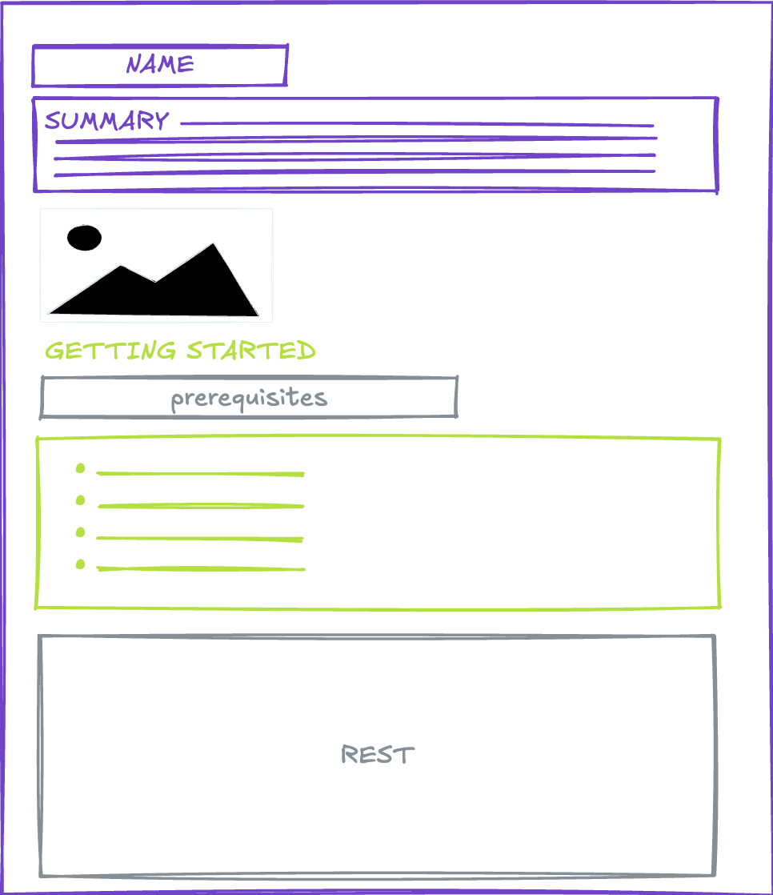

# Checklist for Publishing a New Open Source Project

Before you publish any repository under your organization on GitHub, please go through this checklist and make sure the repository meets these standards.

- [Checklist for Publishing a New Open Source Project](#checklist-for-publishing-a-new-open-source-project)
  - [Repository Name](#repository-name)
  - [Dedicate a Maintainer](#dedicate-a-maintainer)
  - [Community Profile](#community-profile)
    - [Description, Website, and Topics](#description-website-and-topics)
    - [README (Documentation)¨](#readme-documentation)
    - [Contributing](#contributing)
    - [License](#license)
    - [Issue \& Pull Request Templates \& Code of Conduct](#issue--pull-request-templates--code-of-conduct)
    - [Security Policy](#security-policy)
    - [DEVELOPMENT.md](#developmentmd)
  - [GitHub Features](#github-features)
  - [Set Expectations](#set-expectations)
  - [Add Badges](#add-badges)
  - [Add Automatic Tests](#add-automatic-tests)
  - [Review](#review)
  - [Set up Continuous Integration](#set-up-continuous-integration)
  - [Protect the Main Branch](#protect-the-main-branch)
  - [Add Collaborating Teams](#add-collaborating-teams)
  - [Define Release Process](#define-release-process)
  - [Want to Make the Repo Even More Friendly?](#want-to-make-the-repo-even-more-friendly)

## Repository Name

Set repository name according to the [Naming conventions](./Naming-conventions.md).

## Dedicate a Maintainer

It's essential to decide who's going to be responsible for the repository. Every repository needs to have an owner (a person or a team) who will actively:

- Set the right expectations about the project
- Keep the repository in a good shape
- Respond to issues and pull requests

Read more on [the duties of a maintainer](./Duties-of-a-Repository-Maintainer.md).

Mark this user into the [CODEOWNERS](https://help.github.com/articles/about-code-owners/) file.

**Example CODEOWNERS file** (`.github/CODEOWNERS`):

```
# Default owner for everything in the repo
* @your-github-username

# Specific paths can have different owners
/docs/ @docs-team
/src/core/ @core-team
```

## [Community Profile](https://help.github.com/articles/about-community-profiles-for-public-repositories/)

Should be "all green" - complete all recommended community files.

Note: Community profile is available only for public repos and not for forked repos.


### Description, Website, and Topics

Fill in basic information about the project to make it easy to find it.


Tag the repository based on the division according to [Naming conventions](./Naming-conventions.md#github-repositories).

### README (Documentation)¨



README should contain:

- Installation instructions
- Basic demonstration of usage a.k.a. Getting started
- Code examples (if applicable)
- Links to detailed documentation
- Contact information: {{ site.organization.email }}

More complex topics and examples can be covered in separate articles in GitHub Wiki or an external system such as ReadTheDocs.

{: .note }
Consider creating a `.github` repository in your organization to store default community health files that apply to all repositories. [See GitHub documentation](https://docs.github.com/en/communities/setting-up-your-project-for-healthy-contributions/creating-a-default-community-health-file) for details.

### Contributing

From the README or CONTRIBUTING files, it should be clear:

- How to set up the project in order to contribute
  - This may include creating setup scripts to make it easy for contributors
- What kind of contributions are accepted and welcome
- What's the definition of done (use PR templates)
- Which communication channels should be used to get in touch with the maintainer

Can be generated from [Contributor covenant](https://www.contributor-covenant.org/), [Contributing.md generator](https://contributing.md/generator/).

### License

Use the MIT license (or your organization's preferred open source license) and set "{{ site.organization.name }}" as the copyright holder.

Store the license in the "LICENSE" or "LICENSE.md" file.

**Example LICENSE file header:**

```
MIT License

Copyright (c) 2026 {{ site.organization.name }}

Permission is hereby granted, free of charge, to any person obtaining a copy...
```

### Issue & Pull Request Templates & Code of Conduct

Create these files to guide contributors:

- `.github/ISSUE_TEMPLATE/bug_report.md` - Bug report template
- `.github/ISSUE_TEMPLATE/feature_request.md` - Feature request template
- `.github/PULL_REQUEST_TEMPLATE.md` - PR template with checklist
- `CODE_OF_CONDUCT.md` - Community standards

Alternatively, store default templates in a `.github` repository to apply them across all your organization's repositories.

### Security Policy

Create a `SECURITY.md` file documenting:

- Supported versions
- How to report security vulnerabilities
- Security contact: {{ site.organization.email }}
- Expected response time

**Example:**

```markdown
# Security Policy

## Reporting a Vulnerability

If you discover a security vulnerability, please email {{ site.organization.email }}
with details. Do not create a public GitHub issue.

We will respond within 48 hours and provide a timeline for fixes.
```

### DEVELOPMENT.md

> Optional, is short, can be part of the README.

This document describes the process for running this application on your local computer.

You can inspire by [GitHub's docs DEVELOPMENT.md file](https://github.com/github/docs/blob/main/contributing/development.md).

## GitHub Features

Decide which features you turn on or off. This will help set expectations.


Consider:
- **Issues**: Enable for bug reports and feature requests
- **Projects**: Enable if you want to show a public roadmap
- **Wiki**: Enable for detailed documentation (or use external docs)
- **Discussions**: Enable for community questions and announcements

## Set Expectations

You should make clear:

- What kind of support users can expect (README)
  - GitHub issues vs. Stack Overflow, email, etc.
- How to submit bugs (README + Issue templates)
- What the future of the project is and whether it's actively developed
  - Set up a [project board](https://docs.github.com/en/issues/planning-and-tracking-with-projects) to show roadmap
  - [Archive](https://help.github.com/articles/archiving-a-github-repository/) a repo that's no longer being developed

Set up an issue tracker. Most likely, you'll use GitHub issues. Take your time to set up labels and milestones.

**Recommended labels:**
- `bug` - Something isn't working
- `enhancement` - New feature or request
- `documentation` - Improvements or additions to documentation
- `good first issue` - Good for newcomers
- `help wanted` - Extra attention is needed

## Add Badges

Use badges to make it easy to find basic information about the status of the project.

{: .note }
Generate custom badges via [shields.io](https://shields.io/)

**Examples:**

* **Continuous Integration**
  ```markdown
  [](https://github.com/{{ site.organization.github_org }}/repo-name/actions/workflows/ci.yml)
  ```

* **Test Coverage**
  ```markdown
  
  ```

* **Package Status**
  ```markdown
  
  
  ```

* **Community**
  ```markdown
  [](https://stackoverflow.com/tags/{{ site.organization.shortname }})
  ```

{: .note }
Try to unify the style of the badge statuses. If it is not possible, group the styles per line.

## Add Automatic Tests

Include at least a basic set of (unit) tests. This is optional but highly recommended.

**Best practices:**
- Aim for >80% code coverage on critical paths
- Include integration tests for API interactions
- Add end-to-end tests for key user flows (if applicable)
- Document how to run tests locally in CONTRIBUTING.md

## Review

Ask your colleagues to do a code review, basic testing, and proofreading before you publish any project. Consider having a checklist for pre-publication review.

## Set up Continuous Integration

Setting up CI makes it easy for contributors to know whether their code works as expected. This is optional but highly recommended.

You can find more info about CI practices in the [separate article](./ci-and-automation/ci-and-automation.md).

- Set up a build agent - [GitHub Actions](https://docs.github.com/en/actions)
  - Make it run tests
  - Fail builds on failed tests
- Set up [status checks](https://docs.github.com/en/github/administering-a-repository/about-protected-branches#require-status-checks-before-merging) via webhooks

**Recommended workflow checks:**
- Run tests on all PRs
- Check code formatting/linting
- Verify build succeeds
- Check for security vulnerabilities

## Protect the Main Branch

You can learn more about branch protection in the [documentation](https://docs.github.com/en/github/administering-a-repository/managing-a-branch-protection-rule#about-branch-protection-rules).


**Recommended protection rules:**
- Require pull request reviews before merging (minimum 1)
- Require status checks to pass before merging
- Require branches to be up to date before merging
- Require linear history (optional)
- Do not allow bypassing the above settings

## Add Collaborating Teams

Configure team access levels appropriately:


**Typical setup:**
- `Admin` permission for repository maintainers
- `Write` permission for core contributors
- `Triage` permission for community moderators
- `Read` permission for stakeholders who need visibility

## Define Release Process

- Create an initial release (v1.0.0 or v0.1.0 for beta)
- **Always** follow [Semantic Versioning](http://semver.org/)
- Document the release process in CONTRIBUTING.md
- Use GitHub Releases to publish releases
- Include changelogs in release notes
- Tag releases appropriately

**Semantic Versioning reminder:**
- `MAJOR` version: Breaking changes
- `MINOR` version: New features (backward-compatible)
- `PATCH` version: Bug fixes (backward-compatible)

## Want to Make the Repo Even More Friendly?

- Read the [Pre-launch checklist](https://opensource.guide/starting-a-project/#your-pre-launch-checklist)
- Consider adding a `CHANGELOG.md` to track changes
- Set up automated dependency updates (Dependabot)
- Add a `CONTRIBUTORS.md` to recognize contributors
- Create a roadmap or project board to show future plans
- Enable GitHub Discussions for community questions
